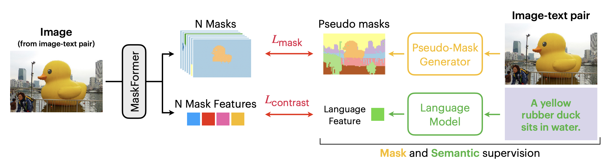

# Exploring Simple Open-Vocabulary Semantic Segmentation

This repository contains the code (in PyTorch) for the model introduced in the following paper:

Exploring Simple Open-Vocabulary Semantic Segmentation [[Paper]](https://arxiv.org/abs/2401.12217) \
[Zihang Lai](https://scholar.google.com/citations?user=31eXgMYAAAAJ&hl=en)

Code will be released soon!